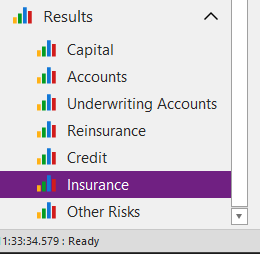
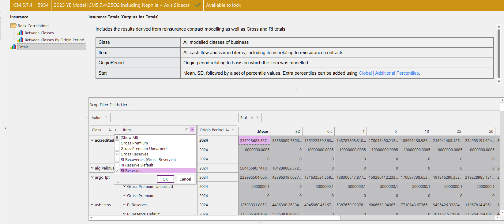
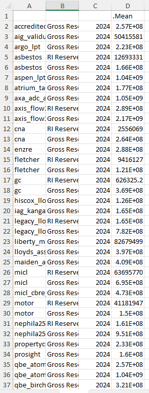
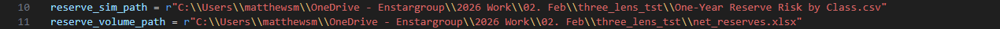

# Documentation for the insurance_lens.py script

## 1. Data Requirements and Manual inputs

If the code is not producing an excel sheet as output please refer to section 1.4
If you wish to change the number of classes displayed in the table please refer to section 2.3

To run this script, you will need to take 3 relatively painless tasks to input the data in a readable format. If done correctly the code should require no real changes.
These tasks are to organise two files and change their file path within the script. One file will be a pure extraction from Igloo in CSV form, the other will some require manual manipulation detailed below.

### 1.1 Reserve Risk sims
This is a CSV extracted from Igloo Desktop. The extraction process is documented here: PLACEHOLER

### 1.2 Class Reserves
This file requires manual manipulation by copying and pasting from Igloo Manager. To accurately set up take the following steps:
Open Igloo Manger and select your desired run by double clicking
Scroll to the bottom of the selection bar on the left and click insurance under Results

Open Rank Correlations and select Total
Now go to the below grid and filter item to show just net and gross reserves

Left click where it says .mean in the column header and select copy with headers
Finally simply paste into A1 of a new excel workbook. Save it and exit. If you do not exit you may run into permission errors.

The final product should look like this:

### 1.3 Path updates
The final step is change the reserve_sim_path and reserve_volume_path variables. They should look like this within the repo:

The easiest way to do this is to left click over the prepared files in sections 1.1 and 1.2 and select copy as path. You can then paste this path ensuring the formatting aligns with the above screenshot. This copying method only has single slashes whereas a the r string requires double slashes so these will have to be added manually.

### 1.4 A note on the output
The last line of code will read: `output_df.to_excel('three_lens_table.xlsx')` This creates an excel file which github doesn't love therefore it is commented out in the repo. If you find the script is not writing to excel, this is likely to be the problem.

## 2. Methodology

The code is split into 3 sections with large comment boxes to divide. While the code is thoroughly commented throughout I have provided an overview of the methodology and any points of interest below

These 3 sections aim to:
1.Drop invalid classes and create two data frames of the same structure so that they can be glued together later on.
2.Find both diversified and undiversified losses at the 95th 
3.Combine the net reserves and loss dataframes into one 3x5 output table.

### 2.1 Import and Adjustment of data

The Igloo outputs do not perfectly align with the data needed for the insurance lens piece due to 2 key problems:

a. QBE2 is split into it's Lloyd's and non-Lloyd's classes
b. assumed classes that are not ADCs do are for entity usage and therefore need to be removed

The data from the two input files organised in sections 1.1 and 1.2 (named df and net_res respectively) perform these drops and are also rearranged into the same thape in this section. This includes renaming and reindexing net_res columns so that the column names and numbers are aligned with df.

### 2.2 Finding 95th Percentile Loss

The corridor of 101 sims around the 95th is defined by start and end variables (9949 and 10050). These values are due to the fact pandas uses 0-based indexing and the end number is non-inclusive. This therefore produces sim indexes 9949:10049. Converting to 1-based indexing gives sims 9950:10050.

`diversified = df.iloc[start:end, 1:].mean(axis = 0, skipna = True)` This snippet takes the average of the aforementioned sims. The second argument for iloc[] averages across all cols apart from the first which contains the sim number and therefore should not be averaged. 

### 2.3 Creating the Output Dataframe

Now the dataframes are in the same structure the script takes the largest 6 columns, this is the top 5 (which we display in the table) and the total number which still exists in the dataframe but will be dropped later.

If you wish to change the number of classes displayed `key_cols = combined_df.loc['net'].nlargest(6).index` this is the snippet that will need to be changed.

The remainder of the code is simply formatting and conversion to different units.